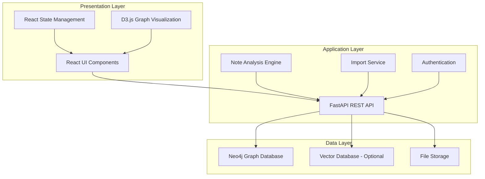
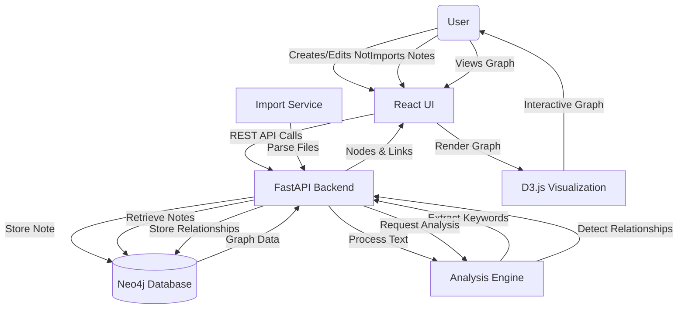
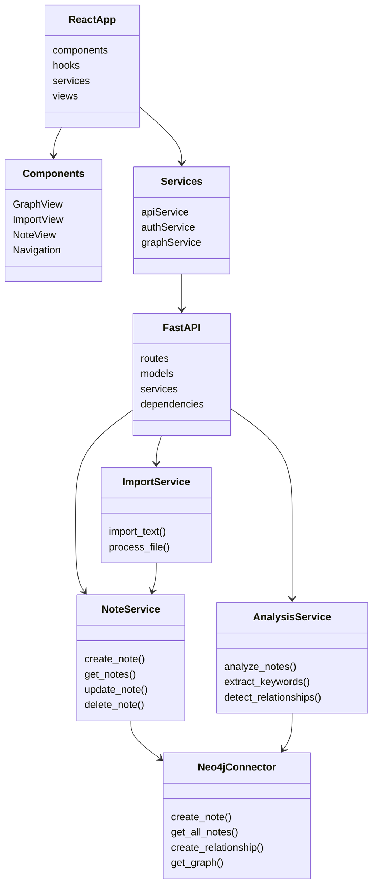
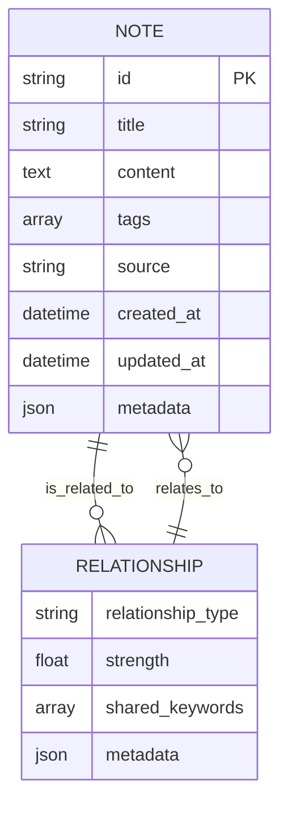

# NoteScape


## 📚 Knowledge Graph Visualization System

NoteScape is an advanced knowledge management application that transforms scattered notes into an interconnected knowledge graph. By automatically analyzing note content and extracting meaningful relationships, NoteScape helps you visualize and navigate your knowledge in a network format, revealing connections you might have missed.

[](https://opensource.org/licenses/MIT)
[](https://reactjs.org/)
[](https://fastapi.tiangolo.com/)
[](https://neo4j.com/)

---

## 📋 Table of Contents

- [Features](#-features)
- [Architecture](#-architecture)
  - [System Architecture](#system-architecture)
  - [Data Flow Diagram](#data-flow-diagram)
  - [Component Diagram](#component-diagram)
  - [Database Schema](#database-schema)
- [Tech Stack](#-tech-stack)
- [Getting Started](#-getting-started)
  - [Prerequisites](#prerequisites)
  - [Installation](#installation)
  - [Environment Configuration](#environment-configuration)
- [Usage](#-usage)
  - [Creating Notes](#creating-notes)
  - [Importing Notes](#importing-notes)
  - [Visualizing the Knowledge Graph](#visualizing-the-knowledge-graph)
  - [Analyzing Relationships](#analyzing-relationships)
- [API Documentation](#-api-documentation)
- [Future Enhancements](#-future-enhancements)
- [Contributing](#-contributing)
- [License](#-license)
- [Contact](#-contact)

---

## ✨ Features

### Core Features

- **Interactive Knowledge Graph Visualization**
  - Force-directed graph layout with D3.js
  - Zoom, pan, and click interactions
  - Node sizing based on note importance
  - Edge thickness reflecting relationship strength

- **Automatic Relationship Extraction**
  - Keyword-based semantic analysis
  - Shared concept detection
  - Relationship strength quantification
  - Transparent relationship metadata

- **Comprehensive Note Management**
  - Create, edit, view, and delete notes
  - Add titles and tags to organize content
  - Import notes from text files
  - Direct text input for quick capture

- **Advanced Note Analysis**
  - Extract important keywords and concepts
  - Detect shared topics between notes
  - Generate relationship visualizations
  - Discover hidden connections

- **Responsive Design**
  - Desktop and mobile-friendly interface
  - Material Design components
  - Intuitive navigation and controls
  - Seamless user experience

---

## 🏗 Architecture

### System Architecture

NoteScape follows a modern three-tier architecture with clear separation of concerns:



### Data Flow Diagram

This diagram illustrates how data flows through the NoteScape system:



### Component Diagram

Detailed breakdown of system components and their interactions:



### Database Schema

Neo4j graph database schema for NoteScape:



---

## 🛠 Tech Stack

### Frontend
- **React.js** - Frontend framework for building the user interface
- **D3.js** - Data visualization library for interactive graph rendering
- **Material UI** - React component library following Material Design
- **Axios** - HTTP client for API requests
- **React Router** - Routing library for navigation

### Backend
- **FastAPI** - Modern, high-performance web framework for building APIs
- **Python 3.9+** - Programming language for backend logic
- **Pydantic** - Data validation and settings management
- **Uvicorn** - ASGI server for running the FastAPI application
- **Natural Language Processing** - Custom algorithms for text analysis

### Database
- **Neo4j** - Graph database for storing notes and relationships
- **Optional Vector Database** - For advanced semantic search capabilities

### DevOps
- **Docker** - Containerization for consistent deployment
- **Git** - Version control system
- **GitHub Actions** - CI/CD pipeline (optional)

---

## 🚀 Getting Started

### Prerequisites

Before installing NoteScape, ensure you have the following installed:

- **Node.js** (v16 or higher)
- **Python** (v3.9 or higher)
- **Neo4j** (v4.4 or higher)
- **Docker** (optional, for containerized deployment)

### Installation

#### Clone the Repository

```bash
git clone https://github.com/yourusername/notescape.git
cd notescape
```

#### Backend Setup

```bash
# Create a virtual environment
python -m venv venv
source venv/bin/activate  # On Windows: venv\Scripts\activate

# Install dependencies
cd app/api
pip install -r requirements.txt

# Start the API server
python main.py
```

#### Frontend Setup

```bash
# Install dependencies
cd ../../app/client
npm install

# Start the development server
npm start
```

#### Neo4j Setup

1. Install and start Neo4j following the [official documentation](https://neo4j.com/docs/operations-manual/current/installation/)
2. Create a new database or use the default
3. Set up appropriate credentials

### Environment Configuration

Create a `.env` file in the root directory with the following configuration:

```
# API Configuration
API_HOST=localhost
API_PORT=8000

# Neo4j Database
NEO4J_URI=bolt://localhost:7687
NEO4J_USER=neo4j
NEO4J_PASSWORD=your_password

# Optional: Vector Database Configuration
# PINECONE_API_KEY=your_pinecone_api_key
# WEAVIATE_URL=http://localhost:8080
# WEAVIATE_API_KEY=your_weaviate_api_key

# Optional: OpenAI for embeddings (if using embedding-based approach)
# OPENAI_API_KEY=your_openai_api_key

# Frontend Configuration
REACT_APP_API_URL=http://localhost:8000/api
```

---

## 📖 Usage

### Creating Notes

1. Navigate to the Notes page
2. Click "New Note"
3. Enter a title and content
4. Add optional tags
5. Click "Save"

### Importing Notes

1. Navigate to the Import page
2. Choose between file upload or direct text input
3. For file upload:
   - Click "Choose File" and select a text file
   - Enter a title for the note
   - Click "Import"
4. For direct input:
   - Enter a title for the note
   - Type or paste your content in the text area
   - Click "Import"

### Visualizing the Knowledge Graph

1. Navigate to the Graph page
2. The graph will load automatically showing all notes and their relationships
3. Interact with the graph:
   - Zoom: Mouse wheel or pinch gesture
   - Pan: Click and drag on empty space
   - Select node: Click on a note
   - See details: Click on a node to view note contents
   - Rearrange: Drag nodes to adjust layout

### Analyzing Relationships

1. After creating several notes, navigate to the Graph page
2. Click "Analyze Relationships" to run the analysis algorithm
3. The graph will update showing newly discovered connections
4. Hover over connections to see shared keywords
5. The thickness of connections indicates relationship strength

---

## 📜 API Documentation

### Note Endpoints

#### Get All Notes

```
GET /api/notes/
```

Response:
```json
[
  {
    "id": "note_123",
    "title": "Sample Note",
    "content": "This is a sample note with some content.",
    "tags": ["sample", "test"],
    "created_at": "2023-11-01T10:30:00Z",
    "updated_at": "2023-11-01T10:30:00Z"
  }
]
```

#### Create Note

```
POST /api/notes/
```

Request Body:
```json
{
  "title": "New Note",
  "content": "This is the content of my new note.",
  "tags": ["important", "research"]
}
```

#### Get Note by ID

```
GET /api/notes/{note_id}
```

#### Update Note

```
PUT /api/notes/{note_id}
```

#### Delete Note

```
DELETE /api/notes/{note_id}
```

### Import Endpoints

#### Import Text Note

```
POST /api/import/text
```

Form data:
- `file`: Text file
- `title`: Note title (optional)

### Analysis Endpoints

#### Analyze Notes

```
POST /api/analyze
```

Response:
```json
{
  "message": "Notes analyzed successfully. Created 5 relationships."
}
```

#### Get Graph Data

```
GET /api/graph
```

Response:
```json
{
  "nodes": [
    {
      "id": "note_123",
      "label": "Sample Note",
      "content": "Sample content...",
      "group": 1
    }
  ],
  "links": [
    {
      "source": "note_123",
      "target": "note_456",
      "type": "shared_topics",
      "value": 0.75
    }
  ]
}
```

---

## 🔮 Future Enhancements

- **Advanced Embedding Models**: Integration with state-of-the-art language models
- **Real-time Collaboration**: Multi-user editing and viewing
- **Expanded Import Capabilities**: Support for PDF, Markdown, and other formats
- **Improved Search**: Full-text and semantic search across all notes
- **Custom Visualization Themes**: Personalized graph appearance
- **Mobile App**: Native mobile experience
- **Browser Extension**: Quick note capture from any webpage
- **AI-powered Suggestions**: Recommend related content and connections

---

## 🤝 Contributing

Contributions are welcome! Please feel free to submit a Pull Request.

1. Fork the repository
2. Create your feature branch (`git checkout -b feature/amazing-feature`)
3. Commit your changes (`git commit -m 'Add some amazing feature'`)
4. Push to the branch (`git push origin feature/amazing-feature`)
5. Open a Pull Request

Please make sure to update tests as appropriate and adhere to the project's code style.

---

## 📄 License

This project is licensed under the MIT License - see the [LICENSE](LICENSE) file for details.

---

## 📞 Contact

Your Name - [bhuvanshah288@gmail.com](mailto:your.email@example.com)

Project Link: [https://github.com/Bhuvannnn/notescape](https://github.com/Bhuvannnn/notescape)

---

## Acknowledgements

- [D3.js](https://d3js.org/)
- [React](https://reactjs.org/)
- [FastAPI](https://fastapi.tiangolo.com/)
- [Neo4j](https://neo4j.com/)
- [Material UI](https://mui.com/)

---

<p align="center">Made with ❤️ for the love of knowledge management</p> 
